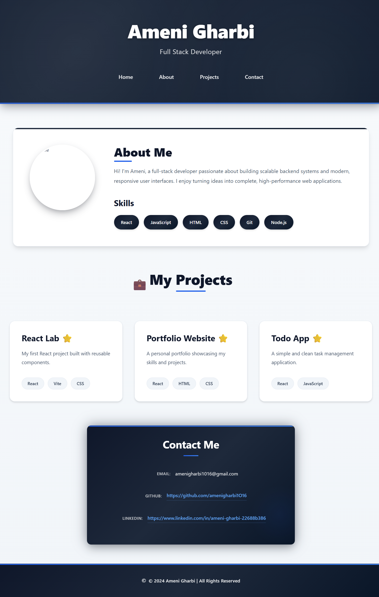

# 🌐 Ameni Gharbi — Personal Portfolio


[](https://portfolio-ly6k.vercel.app/)

> A modern, responsive personal portfolio website built with React and Vite, showcasing my skills, projects, and contact information as a Frontend Developer.

---

## 🔗 Live Demo

> **[https://portfolio-ly6k.vercel.app/](https://portfolio-ly6k.vercel.app/)**

---

## 📸 Preview



---

## ✨ Features

- ⚡ **Fast performance** with Vite
- 📱 **Fully responsive** (desktop, tablet, mobile)
- 🎨 **Clean dark navy & blue** modern UI
- 🧩 **Reusable component-based** architecture
- ♿ **Accessible** and semantic HTML structure

---

## 📂 Project Structure
```
src/
├── components/
│   ├── Header/
│   │   ├── Header.jsx
│   │   └── Header.css
│   ├── About/
│   │   ├── About.jsx
│   │   └── About.css
│   ├── ProjectCard/
│   │   ├── ProjectCard.jsx
│   │   └── ProjectCard.css
│   ├── ProjectShowcase/
│   │   ├── ProjectShowcase.jsx
│   │   └── ProjectShowcase.css
│   ├── Contact/
│   │   ├── Contact.jsx
│   │   └── Contact.css
│   └── Footer/
│       ├── Footer.jsx
│       └── Footer.css
├── assets/
├── App.jsx
├── App.css
├── main.jsx
└── index.css
```

---

## 🛠️ Getting Started

### 1️⃣ Clone the repository
```bash
git clone https://github.com/amenigharbi1O16/portfolio.git
cd portfolio
```

### 2️⃣ Install dependencies
```bash
npm install
```

### 3️⃣ Start development server
```bash
npm run dev
```

Visit:
```
http://localhost:5173
```

---

## 📦 Production Build
```bash
npm run build
```

Preview production build:
```bash
npm run preview
```

---

## 📬 Contact

**Ameni Gharbi** — Frontend Developer

- 📧 **Email:** [amenigharbi1016@gmail.com](mailto:amenigharbi1016@gmail.com)
- 💼 **GitHub:** [github.com/amenigharbi1O16](https://github.com/amenigharbi1O16)
- 🔗 **LinkedIn:** [linkedin.com/in/ameni-gharbi-22688b386](https://www.linkedin.com/in/ameni-gharbi-22688b386/)

---

<div align="center">
  <p>Made with ❤️ by <strong>Ameni Gharbi</strong></p>
  <p>⭐ Star this repo if you found it helpful!</p>
</div>
